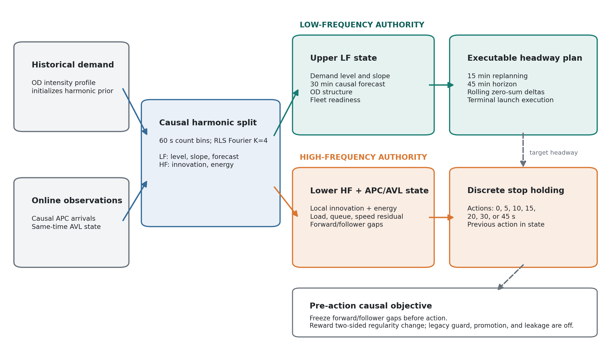
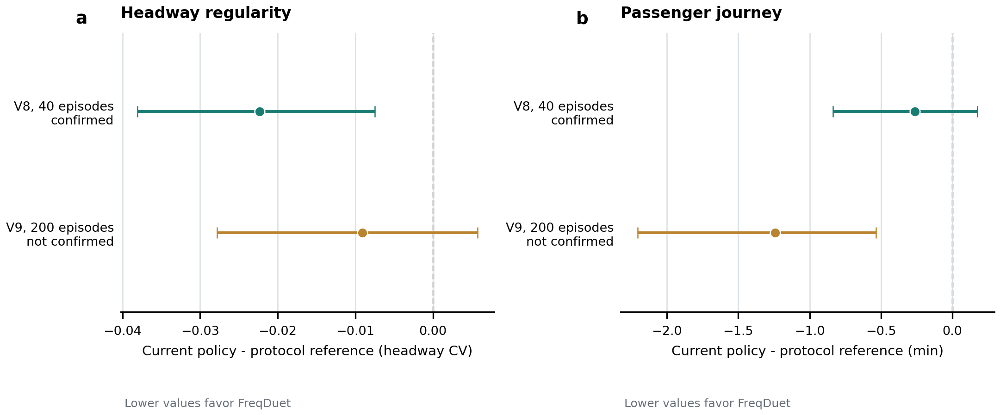
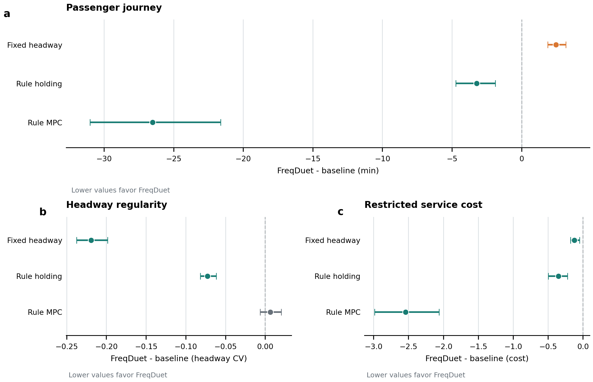
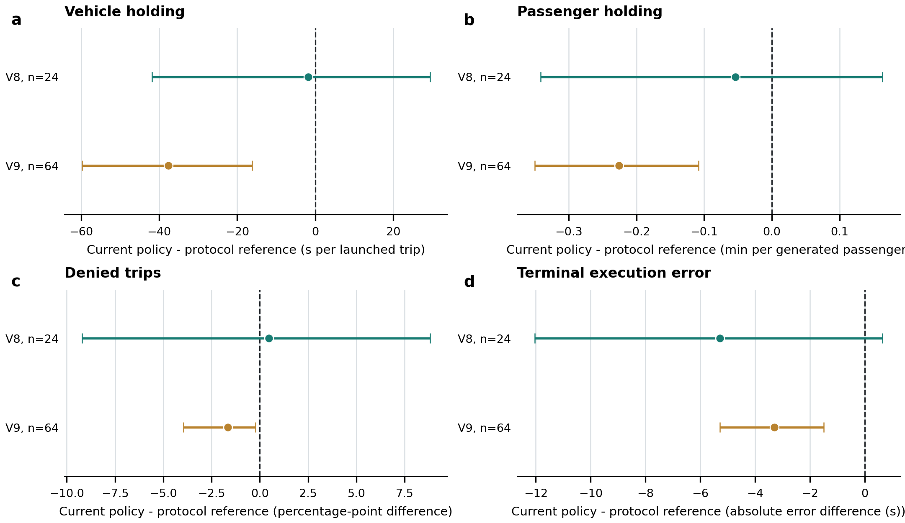
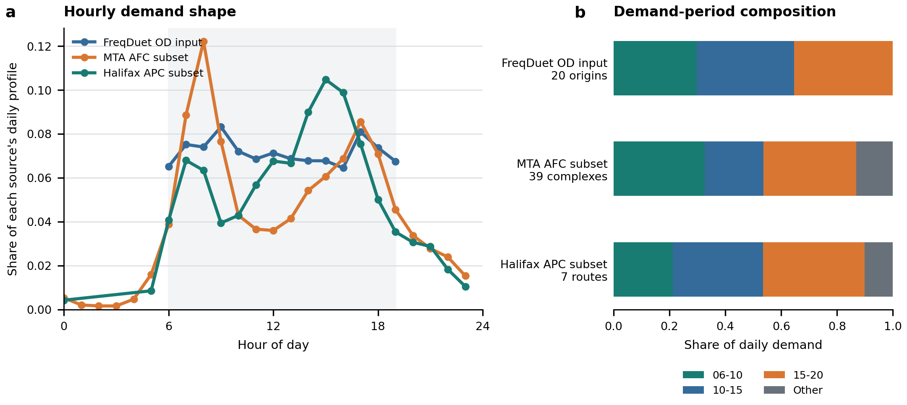

# FreqDuet: Causal Frequency Allocation for Hierarchical Bus Timetable and Holding Control

## Abstract

Hierarchical transit controllers act at different temporal and physical scales,
but commonly expose the same unstructured demand signal to every policy.
FreqDuet instead estimates demand causally from completed APC bins, sends a
harmonic low-frequency state to an executable upper headway planner, and sends
station-local innovations plus compact APC/AVL context to a discrete lower
holding policy. In an independent 40-episode confirmation with 24 paired
rollouts, the complete current controller changed headway coefficient of
variation by -0.022 [-0.038, -0.008]
relative to a same-protocol reference, while restricted passenger journey
changed by
-0.263 [-0.837, +0.175]
min and satisfied the registered no-harm condition. In a separate 200-episode,
64-pair robustness test, journey improved by
-1.242 [-2.204, -0.536]
min, but the headway effect weakened to
-0.009 [-0.028, +0.006] and failed the
registered long-training gate. Against fixed headway, FreqDuet was more regular
but increased passenger journey by
+2.470 [+1.874, +3.188]
min. The results demonstrate a short-training regularity effect and expose its
training-horizon and passenger-service limits; they do not establish long-run
regularity confirmation, fixed-headway passenger superiority, or an isolated
causal effect of frequency separation.

**Keywords:** bus holding; hierarchical reinforcement learning; demand
decomposition; causal observation; headway control; reproducibility


# Methods

## Study question and control setting

FreqDuet studies whether frequency structure in an exogenous demand stream can
be aligned with authority in an asynchronous hierarchical controller. The
upper policy changes an executable target-headway plan at dispatch events; the
lower policy chooses holding at station-arrival events. One upper decision can
therefore span many lower decisions. The current paper controller is
`F_freqduet_protocol_v6_confirmed_main_hiro` under `freqduet-eval-v6`. It is the exact naming alias of the
compact APC/AVL, weight-two controller selected and independently confirmed in
V8.



The simulated bidirectional service operates from
06:00 to 19:00
with a 4-hour clearance period, all
scheduled trips, and a fixed pool of 12
physical vehicles. Passenger arrivals are generated from the local historical
OD-intensity table. The public AFC/APC data are used only for the separate
realism audit and do not calibrate the evaluated policy.

## Causal harmonic demand decomposition

Observed APC arrivals are accumulated in 60-s bins. For bin
`k`, the harmonic basis contains an intercept, a within-day linear trend, and
`K=4` sine/cosine pairs over a
14-h period. Historical OD intensities fit a
ridge-regularized prior for `log(1 + arrival rate)` with ridge
0.01 and initial covariance
0.01. Recursive least squares with forgetting
factor 0.9995 then updates that prior only after the
current observation bin closes. With
basis `phi_k`, coefficients `theta_k`, and pre-update prediction
`lambda_hat_(k|k-1)`, the high-frequency innovation is

```text
r_k = y_k - lambda_hat_(k|k-1).
```

The low-frequency state is the updated nonnegative harmonic rate, its slope,
and its 30-min forecast. The residual and
its exponentially smoothed energy form the high-frequency state. Decisions at
the start of a bin cannot observe arrivals later in that bin. This ordering,
rather than a full-day transform, is the operational no-leakage guarantee.

## Frequency-to-authority allocation

The upper policy receives global low-frequency level, slope and forecast,
together with a scalar high-frequency energy summary and low-frequency OD
structure summaries. The lower policy receives station-direction residual,
residual change, local and global residual energy, the previous holding action,
and compact same-time APC/AVL context: `load`, `capacity`, `queue`, `speed_residual`, `shock_age`, `schedule_slack`, `regularity_hold_target_norm`, `regularity_hold_target_valid`. The scalar energy summary
alerts the upper layer to volatility without giving it the local residual that
drives holding.

The current controller does not use the historical promotion, leakage-penalty,
or legacy causal holding-guard branches. Those mechanisms were development
variants and are not part of the evaluated V6 policy. Consequently, the paper
claim is the behavior of the complete current controller, not an isolated
effect of promotion, leakage regularization, or guard removal.

## Executable upper timetable

The upper ensemble actor produces a headway adjustment bounded to
[-60, 60] s. Every
15 min, the timetable planner maps that action
to an exact terminal headway curve over a
45-min horizon. The
`rolling_zero_sum_delta_v6` projection conserves the cumulative headway
budget over each closed replanning window, preventing hidden phase drift.
Planned launch times are executable: an actual departure occurs no earlier
than both vehicle readiness and the scheduled launch time. Planned and actual
terminal times are logged separately, and terminal shifts are bounded to
[-45, 45] s.

## Discrete lower holding and regularity reward

At each eligible station arrival, the lower categorical ensemble policy
chooses holding from `{0, 5, 10, 15, 20, 30, 45}` s. The sampled action is sent to the
environment without a post-policy projection. The lower state includes the
analytic balancing target derived from a matched predecessor departure and a
same-time AVL estimate of the following vehicle.

Let `g_f` be the pre-action forward departure gap, `g_b` the same-time
follower gap, `h` the executable target headway, and `a` the sampled hold. A
hold predicts gaps `g_f + a` and `max(g_b - a, 0)`. For tolerance
`tau=0.02`, define

```text
q(g,h) = max(|g-h|/h - tau, 0)^2
L(g_f,g_b,h) = 0.5 * [q(g_f,h) + q(g_b,h)].
```

The lower reward receives
`2 * clip(L_before - L_after, -0.25, 0.25)`.
All gaps are frozen before the action. Missing predecessor or follower evidence
adds zero regularity reward and is logged rather than imputed from future
vehicle states.

## Learning architecture

Both levels use off-policy soft actor-critic variants. The upper
`pessimistic_ensemble_sac_v4` uses a pessimistic
10-critic ensemble, discount
0.95, a 64-unit hidden
representation, batch size 64, and
10 updates per episode. The lower
`pessimistic_ensemble_sac_lagrangian_v4` uses a pessimistic
10-critic ensemble, discount
0.99, a 64-unit hidden
representation, batch size 512, and
30 updates per episode. Both learning rates
are `0.0003`; the lower dual learning rate is
`0.0001`. The upper policy begins after a
30-episode lower
warm-up. V8 trains for 40 episodes and evaluates checkpoint 39; V9 trains
without policy or critic freezing for 200 episodes and evaluates checkpoint
199.

## Outcomes

The primary passenger endpoint is restricted total journey time per generated
passenger. Waiting is censored at the evaluation horizon for passengers not
yet boarded; in-vehicle and total journey time are censored at that horizon for
passengers not yet arrived. Secondary outcomes are restricted waiting time,
restricted in-vehicle time, unserved-passenger rate, headway coefficient of
variation, realized vehicle and passenger holding, fleet-denial measures,
terminal execution error, trip completion, and restricted service cost.
Headway CV is the standard deviation divided by the mean over valid recorded
headway events. With restricted waiting `W_R` in minutes, peak fleet `F`, fixed
fleet budget `N`, headway CV `H`, unserved fraction `U`, and trip-completion
fraction `Q`, the secondary scalar is

```text
C_R = W_R / 10
    + max(F - N, 0)^2 / N
    + H
    + 5 U
    + 5 (1 - Q).
```

The evaluated fixed-pool environment makes the overshoot term zero; this
scalar does not directly charge holding or a delayed-readiness denial that is
later retried. It is therefore a secondary summary and does not replace the
passenger and physical outcomes.

## Evaluation and inference

V8 is a preregistered independent 40-episode confirmation with six training
seeds crossed with four untouched evaluation seeds (24 paired rollouts per
policy). V9 is a separately preregistered 200-episode robustness test with
eight new training seeds crossed with eight new evaluation seeds (64 paired
rollouts per policy). The Protocol V6 reference is `F_freqduet_protocol_v6_noguard_hiro`. Both policies
disable the legacy holding guard; the current policy additionally has compact
APC/AVL context and the two-sided regularity objective, so their difference is
a combined-policy contrast.

Uncertainty uses a crossed bootstrap over training and evaluation seeds while
sharing each evaluation-seed resample across paired policies. Two-sided
sign-flip tests operate on training-seed mean differences, with Holm correction
within each metric family. Lower values favor FreqDuet for every reported
outcome. The V8 and V9 estimates are kept separate and are never pooled.


# Results

## Independent confirmation at 40 episodes

V8 confirmed the registered regularity effect of the complete current policy
(Fig. 2; Table 1). Relative to the Protocol V6 reference, headway CV changed by
-0.022 [-0.038, -0.008]. Restricted
passenger journey changed by
-0.263 [-0.837, +0.175]
min. The latter interval crossed zero but satisfied the preregistered journey
no-harm margin. Thus V8 supports a short-training regularity improvement; it
does not establish a passenger-journey benefit.



**Table 1. Current policy minus the Protocol V6 reference.** Values are paired
mean differences with crossed-bootstrap 95% confidence intervals. Lower is
better. Holm-adjusted sign-flip p-values use training-seed mean differences.

| Outcome | V8 delta [95% CI] | V8 Holm p | V9 delta [95% CI] | V9 Holm p |
| --- | --- | --- | --- | --- |
| Restricted passenger journey (min) | -0.263 [-0.837, +0.175] | 0.938 | -1.242 [-2.204, -0.536] | 0.047 |
| Restricted passenger wait (min) | -0.185 [-0.470, +0.050] | 0.375 | -1.011 [-1.878, -0.397] | 0.047 |
| Restricted in-vehicle time (min) | -0.078 [-0.376, +0.147] | 1.000 | -0.232 [-0.355, -0.121] | 0.047 |
| Headway coefficient of variation | -0.022 [-0.038, -0.008] | 0.125 | -0.009 [-0.028, +0.006] | 0.031 |
| Unserved passengers (percentage points) | +0.02 [-0.00, +0.11] | 1.000 | +0.00 [+0.00, +0.02] | 0.250 |
| Realized holding (s/launched trip) | -1.7 [-41.8, +29.4] | 1.000 | -37.6 [-59.8, -16.2] | 0.070 |
| Trips denied at least once (percentage points) | +0.48 [-9.21, +8.81] | 1.000 | -1.65 [-3.96, -0.22] | 0.117 |
| Restricted service cost | -0.040 [-0.079, -0.007] | 0.125 | -0.110 [-0.207, -0.042] | 0.047 |

## Long-training robustness was not confirmed

At 200 episodes, the same policy improved restricted journey by
-1.242 [-2.204, -0.536]
min relative to the reference. The headway-CV difference was
-0.009 [-0.028, +0.006]. Seven of
eight training-seed CV differences were negative, but the interval included
zero and the mean improvement did not reach the registered 0.02 threshold.
V9 therefore returned `longtrain_not_confirmed`; the favorable journey result
cannot be relabelled as confirmation of the registered regularity effect.

## External baselines reveal a passenger-regularity trade-off

The source-identical V9 comparison (Fig. 3; Table 2) shows that FreqDuet had
lower headway CV than fixed headway,
-0.219 [-0.238, -0.198], and lower
restricted service cost,
-0.122 [-0.180, -0.050].
However, restricted journey was higher by
+2.470 [+1.874, +3.188]
min. FreqDuet also used
+286.8 [+269.7, +302.0] more
holding seconds per launched trip and had a
+64.10 [+61.97, +66.03]
percentage-point higher denied-trip rate. All trips were eventually launched
and completed in the aggregated learned-policy results, so this denial measure
captures delayed fleet readiness rather than permanent trip cancellation.
Because the restricted service-cost scalar does not directly charge holding or
retried readiness denials, its favorable difference cannot be interpreted as
passenger-time or fleet-readiness superiority.

FreqDuet reduced restricted journey relative to rule holding by
-3.224 [-4.727, -1.885]
min and relative to rule MPC by
-26.511 [-31.003, -21.628]
min. The supported external conclusion is therefore narrower than universal
superiority: FreqDuet reduced restricted journey relative to the two rules and
produced more regular service than fixed headway, while fixed headway remained
better for passenger journey and fleet-readiness burden.



**Table 2. FreqDuet minus external baseline under V9.** Values are paired mean
differences with crossed-bootstrap 95% confidence intervals. Lower is better.
The complete outcome and adjusted-test table is in the Supplementary Material.

| Baseline | Journey min | Headway CV | Denied trips (pp) | Service cost |
| --- | --- | --- | --- | --- |
| Fixed headway | +2.470 [+1.874, +3.188] | -0.219 [-0.238, -0.198] | +64.10 [+61.97, +66.03] | -0.122 [-0.180, -0.050] |
| Rule holding | -3.224 [-4.727, -1.885] | -0.073 [-0.082, -0.062] | -3.17 [-5.42, -1.90] | -0.351 [-0.496, -0.221] |
| Rule MPC | -26.511 [-31.003, -21.628] | +0.006 [-0.006, +0.020] | +61.52 [+59.09, +63.77] | -2.541 [-2.984, -2.060] |

## Physical execution audit

Relative to the Protocol V6 reference, V9 reduced realized holding by
-37.6 [-59.8, -16.2] s
per launched trip and the denied-trip rate by
-1.65 [-3.96, -0.22]
percentage points (Fig. 4). These are full-policy differences, not isolated
effects of the regularity reward. Against fixed headway, however, the current
policy used
+286.8 [+269.7, +302.0] more
holding seconds per launched trip and increased the denied-trip rate by
+64.10 [+61.97, +66.03]
percentage points. All trips were eventually launched and completed in the
aggregated learned-policy results, so denial records delayed fleet readiness
rather than permanent trip cancellation.



## External data support demand-shape realism only

The FreqDuet OD input has a morning peak similar in timing to the bounded MTA
AFC subset, while its normalized hourly profile differs from the Halifax APC
subset (Fig. 5). The balanced audit contains 39 complete MTA station-complex
days (936 rows) and seven complete Halifax routes across 37 route-days (979
rows). Because systems, dates, sampling units, and measurement processes are
unmatched, these comparisons are descriptive checks of demand-shape
plausibility. They are not same-day calibration, route-family policy tests, or
field-effect estimates.



## Interpretation

The current evidence establishes one positive and one negative result. A
compact, causally observable APC/AVL state plus a two-sided local regularity
reward improved headway regularity at 40 episodes without violating the
journey no-harm gate. The same registered regularity effect was not robustly
confirmed after 200 episodes, although passenger journey improved relative to
the Protocol V6 reference. Moreover, the confirmatory contrast retains the
same harmonic frequency pathway in both arms. It therefore evaluates the
complete current controller and does not, by itself, identify the causal effect
of frequency separation versus no-frequency or raw-history control.
